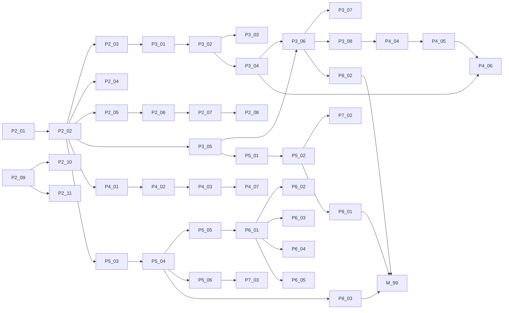

# Plan: shalgalt-omr — Master Plan & Architecture (v1.0 Roadmap)

> Master plan covering product vision, design system, target architecture,
> migration of existing P0/P1 work, and a 40+ atomic sub-issue catalog ready
> for GitHub Issues creation. This is the single source of truth that every
> sub-issue references.
>
> Authoring rules:
> - All identifiers, comments, doc-comments, and this plan are in **English** (CLAUDE.md).
> - All end-user UI strings must be in **Mongolian Cyrillic** (CLAUDE.md).
> - GitHub Issue titles and bodies are in **English**.

---

## 1. Summary

`shalgalt-omr` is a local-first Tauri 2 desktop application that lets ordinary
(non-IT) Mongolian K–12 teachers (a) generate printable OMR answer sheets,
(b) grade scanned PDFs offline — including pages captured with a mobile
scanner like CamScanner — and (c) export results to Excel. It ships with an
embedded HTTP API (axum) that any other internal tool can talk to, so the app
is also the foundation of a small ecosystem of teacher tools.

Three product pillars:

1. **Teacher-friendly UX.** Wide click targets, generous typography, mouse-first,
   light theme by default, Mongolian-only UI copy, dashboard with sidebar.
2. **Resilient offline pipeline.** Robust to MFP scans **and** mobile scans,
   no network required, deterministic CV with explicit confidence scoring.
3. **Open ecosystem foundation.** The grading and project-file primitives live
   in a reusable Rust core crate with a documented HTTP API that can ship as
   a standalone server too — not just inside the desktop app.

## 2. User Story

```
As a regular Mongolian K–12 teacher (not an IT specialist),
I want to design OMR answer sheets, print them, and grade scanned answer
papers — including pages captured with my phone scanner — without internet,
So that I save hours per exam and produce a clean Excel grade book my school
can archive.
```

## 3. Problem → Solution

| Problem (current) | Solution (target) |
| --- | --- |
| Teachers grade hundreds of papers by hand or in unfamiliar tools. | One desktop app: design → print → scan → grade → Excel, in Mongolian. |
| Mobile-scanner output (CamScanner, phone camera) often confuses CV pipelines. | Robust preprocessing: deskew + ArUco markers + adaptive thresholding + per-bubble confidence scoring + manual-review UI for low-confidence sheets. |
| Sharing exams between teachers means juggling multiple files. | A single `.shalgalt` zip container (template + answer key + optional exam PDF + optional roster), with optional passphrase encryption. |
| Other internal tools cannot reuse the grading logic. | The grading engine and HTTP API live in a separate `shalgalt-core` crate that the Tauri app embeds AND can be deployed as a standalone server. |
| Setup is a barrier. | Github Releases distribution: signed Windows installer first, then macOS + Linux. Auto-update opt-in. |

## 4. Metadata

- **Complexity**: XL (program-level, multi-quarter; split into 8 phases).
- **Source PRD**: this plan (no upstream PRD — generated from user prompt + image).
- **Estimated work units (sub-issues)**: 50 (see §15).
- **Estimated files touched**: 200+ across `src/`, `src-tauri/`, `crates/`, `apps/`, `docs/`.

---

## 5. Existing-Code Audit (Q1 = C: salvage / refactor / discard)

The audit below classifies every existing module under `src/` and `src-tauri/`.
"Refactor" means logic is salvaged but the surrounding interface or location
moves. "Discard" means the file is removed entirely.

### 5.1 Frontend (`src/`)

| Path | Verdict | Reason |
| --- | --- | --- |
| `src/app.html`, `src/app.css` | Keep + extend | Already Tailwind v4 with shadcn tokens. Add light theme variables and "comfortable" font scale. |
| `src/routes/+layout.svelte` | Keep | Sidebar + header + status bar shell is correct shape. |
| `src/routes/+page.svelte` (dashboard) | Refactor | Replace placeholder list with widget grid (recent exams, recent results, quick actions). |
| `src/routes/editor/+page.svelte` | Keep | P1 editor entry point. |
| `src/routes/grade/+page.svelte` | Refactor | P0 stub — rebuild as full batch-grading UI in P3. |
| `src/routes/results/+page.svelte` | Refactor | Add review UI, export action, filtering. |
| `src/lib/components/shell/{AppSidebar,StatusBar,IdeShell}.svelte` | Keep + restyle | Add light-theme support and comfortable spacing. `IdeShell.svelte` is unused — discard. |
| `src/lib/components/editor/*` | Keep | Solid svelte-konva foundation; expand in P2 (preset library, validation badges). |
| `src/lib/components/ui/*` (shadcn copies) | Keep | Standard shadcn-svelte. Add light theme tokens. |
| `src/lib/db/*` | Keep + extend | Add `exams` and `answer_keys` repositories in P3. |
| `src/lib/ipc/scan.ts`, `src/lib/ipc/export.ts` | Keep + extend | Add `pdf_generate`, `project_file_*` wrappers in P2/P4. |
| `src/lib/picker.ts` | Keep | Dialog wrappers are correct. |
| `src/lib/stores/*` | Keep | Runes-based stores are good. Add `themeMode.svelte.ts` and `comfortMode.svelte.ts`. |
| `src/lib/templates/mongolianStandard.ts` | Keep | Correct shape, but coordinates need to be re-verified against the reference image and migrated to a presets folder structure. |
| `src/lib/types/template.ts` | Refactor (extend) | Add `variants: Variant[]`, `paper: PaperSpec`, `numericGroups`, `examIdGroup`, `markerKind: "square" \| "aruco"`. |
| `src/lib/i18n/{mn,index}.ts` | Keep + grow | Add string keys for new screens. |
| `src/lib/fs/templateAssets.ts` | Refactor | Generalize to a `projectFile.ts` for the new `.shalgalt` format. |
| `src/lib/hooks/is-mobile.svelte.ts` | Keep | shadcn dependency. |

### 5.2 Rust core (`src-tauri/src/`)

| Path | Verdict | Reason |
| --- | --- | --- |
| `lib.rs`, `main.rs`, `paths.rs`, `state.rs`, `error.rs` | Keep + extend | Correct boot order. Add core-crate registration. |
| `commands/scan.rs`, `commands/export.rs` | Keep + extend | Add `commands/pdf_generate.rs`, `commands/project.rs`. |
| `domain/{template,result,student}.rs` | Refactor | Move into `crates/shalgalt-core/src/domain/`. Extend `template.rs` with variants, paper, marker kind. |
| `scan/{pipeline,pdf,perspective,bubbles,preview}.rs` | Refactor | Move into `crates/shalgalt-core/src/scan/`. Replace stubs with real implementations. Add ArUco marker detection. |
| `grading/{mod,engine}.rs` | Refactor | Move into `crates/shalgalt-core/src/grading/`. Implement scoring rules including partial credit and per-form answer keys. |
| `export/{mod,xlsx}.rs` | Refactor | Move into `crates/shalgalt-core/src/export/`. Implement real xlsx with multiple sheets (summary / per-question / errors). |
| `api/{server,routes,cors}.rs` | Refactor | Move into `crates/shalgalt-core/src/api/`. Add real REST endpoints. Replace permissive CORS with allow-list. Add optional bearer token. |
| `migrations/0001_init.sql`, `0002_backdrop.sql` | Keep | Append `0003_exams_and_answer_keys.sql`, `0004_jobs.sql`, etc. — never edit existing migrations. |
| `tauri.conf.json` | Keep + extend | Add updater endpoint, signing identifier, file associations for `.shalgalt`. |
| `capabilities/default.json` | Keep + extend | Add scopes for new commands. |

### 5.3 Discard list

- `src/lib/components/shell/IdeShell.svelte` — superseded by `+layout.svelte` + sidebar.
- `docs/adr/0001-windows-opencv-strategy.md` only stays *iff* we keep opencv on Windows; if §6.4 ArUco-via-pure-Rust path is chosen, this ADR is superseded.

### 5.4 Tests / docs

| Path | Verdict | Reason |
| --- | --- | --- |
| `src-tauri/tests/` | Keep + grow | Add integration tests around grading + project file round-trip. |
| `docs/BLUEPRINT.md` | Refactor | Update for v1.0 product scope (PDF gen, project file, ecosystem). |
| `docs/ARCHITECTURE.md` | Refactor | Reflect the workspace split (apps/ + crates/). |
| `docs/adr/` | Keep + grow | One ADR per locked architectural decision (see §16). |

---

## 6. Strategic Architecture Decisions (locked)

These decisions are locked. Each becomes an ADR (`docs/adr/NNNN-*.md`).

### 6.1 Workspace becomes a Cargo workspace + monorepo

```
shalgalt-omr/
├── apps/
│   ├── desktop/           # current src-tauri/ moves here
│   └── server/            # new — standalone axum binary
├── crates/
│   ├── shalgalt-core/     # domain + grading + export + api router (no tauri)
│   ├── shalgalt-pdf/      # OMR PDF generator (printpdf-based)
│   ├── shalgalt-cv/       # CV pipeline (opencv + pdfium + ArUco)
│   └── shalgalt-fileformat/  # .shalgalt zip + age encryption
├── src/                   # SvelteKit frontend (unchanged location)
├── docs/
└── ...
```

Rationale: the desktop app and the standalone server share `shalgalt-core`, so
the HTTP contract is identical and zero-copy across deployments.

### 6.2 PDF generation: `printpdf` + `Canvas` wrapper + locked Mongolian-standard layout

Pure Rust, deterministic, embeds TTF for Cyrillic, supports vector primitives
(circles, rectangles, lines, text) — exactly the OMR card vocabulary. We
bundle Noto Sans / Noto Sans Mongolian at compile time via `include_bytes!`.
Alternatives considered: `typst` (heavy, dynamic), webview `printToPdf` (non-deterministic across OSes), `wkhtmltopdf` (external dep).

The renderer sits behind a thin `Canvas` wrapper (`crates/shalgalt-pdf/src/canvas.rs`)
that owns BT/ET pairing, font handles, fill / stroke colour, and line width — see
[ADR 0007](../../../docs/adr/0007-canvas-wrapper-and-layout-modules.md). Every layout
submodule (`markers`, `header`, `bubble_grid`, `labels`, `manual_entry`,
`numeric_block`, `section_headers`, `sidebar`) calls intent-shaped helpers
(`canvas.text`, `canvas.text_centered_in_circle`, `canvas.circle_stroked`,
`canvas.hline`) instead of emitting raw `printpdf::Op`. The wrapper mechanically
prevents the four bug categories diagnosed during the P2-06 follow-up: text-cursor
accumulation, font-fallback drift, in-circle digit centring, and row-label alignment.

Bubble-label position is **inside the circle** (AMC convention, matches
Mongolian-school cards) — auto-fitted to ≈ 65 % of bubble diameter, well below the
0.35 fill threshold so a fully-inked answer dwarfs the printed glyph. See
[ADR 0008](../../../docs/adr/0008-bubble-label-position.md).

Sidebar instructions render as a **horizontal top-right** block (NOT rotated 90°) and
use the body Latin-Cyrillic font; the Mongolian-script font stays embedded for future
traditional-script support. Re-aligning to vertical rotation requires a new ADR.

Card geometry, coordinates, font sizes, and the page-split ratio (25 % top zone /
75 % body zone with 12 mm margins) are locked in
[`docs/MONGOLIAN_OMR_SPEC.md`](../../../docs/MONGOLIAN_OMR_SPEC.md). Layout changes
follow that doc's §7 procedure (issue → spec doc → TS preset + Rust fixture + golden
regen, all in one PR).

### 6.3 Project-file format: `.shalgalt` (zip) + optional `age` encryption

Container layout:

```
example.shalgalt   (zip)
├── manifest.json          # version, exam_id, title, created_at, encrypted: bool, hint: string?
├── template.json          # OmrTemplate (Rule 3)
├── answer-keys.json       # { "A": [...], "B": [...], "C": [...], "D": [...] }
├── metadata.json          # school, teacher, subject, exam_date, notes
├── students.csv           # optional roster
└── exam.pdf               # optional original test paper
```

When encrypted: every file *except* `manifest.json` is wrapped in `age`
passphrase recipients. `manifest.json` stays plaintext so that file managers,
the dashboard, and the import dialog can preview metadata before unlock.
Encryption uses `age` ASCII armor for portability.

### 6.4 CV strategy: opencv (kept) + ArUco markers (new)

Keep `opencv-rust` for thresholding, contour detection, perspective transform,
and bubble density. Add ArUco fiducial markers (4 corners) — much more
robust than plain corner squares against rotation, partial occlusion, and
low-quality phone scans. Mongolian-standard preset migrates from corner
squares to 6×6 ArUco markers in P2. Alignment uses each marker's four
corners as homography correspondences (`find_homography` + RANSAC) and
tolerates one missing marker — **≥3 of 4** markers is enough to align a page
(ADR 0016).

### 6.5 Mobile-scanner robustness

Scan pipeline gains:

1. Auto-deskew via Hough lines.
2. Adaptive Gaussian thresholding (was global threshold).
3. Illumination normalization (subtract median-blur background).
4. Per-bubble confidence score: ratio of dark pixels in inner disc vs
   annulus. Sheets where any bubble's confidence is in `[0.35, 0.65]`
   "uncertain band" are marked `needs_review` and routed to the manual
   review UI.

### 6.6 Auth strategy for the HTTP API

- **Local mode** (default, used by Tauri): bound to `127.0.0.1:22345` (ADR 0015 — moved off
  the contended 8080; auto-falls-back to the next free port if busy and advertises the
  bound port via `app_data_dir/api-endpoint.json` + the `api_info` IPC command), no auth.
  `SHALGALT_API_PORT` overrides the starting port for developers.
- **Server mode**: bound to `0.0.0.0:22345` by default (configurable via `--bind`; no
  fallback — a busy port is a hard error), requires a Bearer token from env var
  `SHALGALT_API_TOKEN`. CORS is allow-list driven from a config file.

### 6.7 Theming: light default, dark optional, no high-contrast

- Tokens added to `app.css` for both palettes.
- `mode-watcher` (already in deps) drives theme attribute on `html`.
- A persistent toggle in the sidebar footer.
- Comfortable mode (single 16 → 18 px base toggle) lives next to the theme toggle.

### 6.8 Auto-update via tauri-plugin-updater + GitHub Releases

- Signed bundles uploaded to Releases by the `release.yml` workflow.
- Update manifest is a static JSON file in the `gh-pages` branch (or the same
  release asset).
- Updates are **opt-in** at install time; teachers in offline schools won't
  see prompts.

### 6.9 Distribution priority

1. **Windows** — NSIS + MSI bundles, code-signed if a cert is available.
2. **macOS** — Apple Developer signed `.dmg`. Notarization optional in v1.
3. **Linux** — AppImage + `.deb`.

### 6.10 Telemetry

**No telemetry, no crash reporting, no analytics.** Teachers run on offline
school networks. Local rotating logs only (already wired via `tauri-plugin-log`).

---

## 7. Design System for Older Teachers

### 7.1 Typography scale

Two variants triggered by the `comfort` toggle.

| Token | Default | Comfortable |
| --- | --- | --- |
| `--text-xs` | 12px | 14px |
| `--text-sm` | 14px | 16px |
| `--text-base` | 16px | 18px |
| `--text-lg` | 18px | 20px |
| `--text-xl` | 22px | 24px |
| `--text-2xl` | 28px | 32px |

Body uses `--text-base`. All buttons, table cells, form fields use
`--text-base` minimum.

### 7.2 Hit targets and spacing

- Minimum interactive height: **40 px** (default), **48 px** (comfortable).
- Minimum click target: **40 × 40 px**.
- Sidebar items: 44 px tall, 16 px horizontal padding, lucide icons at 20 px.

### 7.3 Color palette (light default)

| Role | Light | Dark |
| --- | --- | --- |
| `--background` | `oklch(99% 0 0)` | `oklch(14% 0 0)` |
| `--foreground` | `oklch(20% 0 0)` | `oklch(96% 0 0)` |
| `--muted` | `oklch(96% 0 0)` | `oklch(20% 0 0)` |
| `--primary` | `oklch(54% 0.18 250)` | `oklch(70% 0.18 250)` |
| `--success` | `oklch(58% 0.16 145)` | `oklch(70% 0.16 145)` |
| `--warning` | `oklch(70% 0.18 80)` | `oklch(78% 0.18 80)` |
| `--destructive` | `oklch(57% 0.21 27)` | `oklch(67% 0.21 27)` |

Contrast ratio target: WCAG AA on body text, AAA on primary buttons.

### 7.4 Iconography

- `@lucide/svelte` only. No emoji in product UI.
- Icons paired with **always-visible Mongolian labels** in primary nav and
  toolbars. Icon-only is allowed only for compact toolbars with tooltips.

### 7.5 Empty-state and error pages

Every empty state ships with:
1. A neutral illustration or large lucide icon.
2. Mongolian explanatory copy.
3. A primary CTA that resolves the empty state.

### 7.6 Keyboard support

Mouse-first. Keyboard shortcuts are a secondary path:
- `Ctrl/Cmd+S` — save in editor.
- `Ctrl/Cmd+O` — open project file.
- `Ctrl/Cmd+P` — print OMR card.
- `Esc` — close dialogs.

---

## 8. Target Module Architecture

### 8.1 Workspace Cargo layout (after migration)

```
[workspace]
members = [
    "apps/desktop",
    "apps/server",
    "crates/shalgalt-core",
    "crates/shalgalt-store",
    "crates/shalgalt-pdf",
    "crates/shalgalt-cv",
    "crates/shalgalt-fileformat",
]
resolver = "2"
```

### 8.2 Crate responsibilities and boundaries

| Crate | Depends on | Public surface |
| --- | --- | --- |
| `shalgalt-core` | (only `serde`, `thiserror`, `anyhow`, `axum`, `tower-http`, `utoipa`, `tracing`, `constant_time_eq`) | `domain::*`, `grading::engine::Grader`, `export::xlsx::*`, `api::router(state) -> Router`, `api::{DataStore, AppState}` + DTOs + OpenAPI (`ApiDoc`). DB-free. |
| `shalgalt-store` | `rusqlite` (`bundled`), `shalgalt-core` | `SqliteStore` (read-only / read-write) + `DeferredReadOnlyStore`, implementing `shalgalt-core::api::DataStore`. The one place a second SQLite connection lives (see ADR 0014). |
| `shalgalt-pdf` | `printpdf`, `shalgalt-core::domain` | `pub fn render_template(&Template, &PdfOptions) -> Result<Vec<u8>>`. |
| `shalgalt-cv` | `opencv`, `pdfium-render`, `shalgalt-core::domain` | `pub fn process_pdf(path, template) -> Result<Vec<ParsedSheet>>` with progress callback. |
| `shalgalt-fileformat` | `zip`, `age`, `serde`, `serde_json`, `chrono`, `thiserror` (deliberately **not** `shalgalt-core` — streams opaque named blobs, stays domain-agnostic; see ADR 0011) | `open(path, passphrase?) -> Result<(Manifest, EntryIter)>`, `open_manifest_only(path) -> Result<Manifest>`, `write(path, &Manifest, entries, passphrase?) -> Result<()>`, plus `Manifest` / `ReadHandle` / `FileFormatError`. |
| `apps/desktop` | all crates above + `shalgalt-store`, tauri 2 | Boot Tauri, register plugins, embed `shalgalt-core::api::router` over a read-only `shalgalt-store`. |
| `apps/server` | `shalgalt-core`, `shalgalt-store` | Standalone CLI: `shalgalt-server --bind 0.0.0.0:22345 --db file.sqlite --allow-origin …` (default port per ADR 0015). |

### 8.3 Frontend layout (additions)

```
src/lib/
├── components/
│   ├── exam/                 # exam list + new-exam wizard (P3)
│   ├── grader/               # batch grade + per-page review (P3)
│   ├── pdf-preview/          # printpdf preview iframe (P2)
│   ├── theme/                # ThemeToggle, ComfortToggle
│   └── widgets/              # dashboard widgets
├── ipc/
│   ├── pdf.ts                # render_omr_pdf invoke
│   ├── project.ts            # project_open / project_save / project_export
│   └── update.ts             # check_for_update wrapper
└── stores/
    ├── themeMode.svelte.ts
    └── comfortMode.svelte.ts
```

### 8.4 New Tauri commands (Rule 1 — paths only)

| Command | Args | Returns | Module |
| --- | --- | --- | --- |
| `pdf_generate_omr` | `template_id, variant, output_path` | `()` | `crates/shalgalt-pdf` |
| `project_open` | `path, passphrase?` | `ProjectSummary` | `crates/shalgalt-fileformat` |
| `project_save` | `path, project, options` | `()` | `crates/shalgalt-fileformat` |
| `project_export` | `path, options` | `()` | `crates/shalgalt-fileformat` |
| `scan_grade_pdf` (existing — extend) | `pdf_path, template_id, answer_key_id` | `task_id` | `crates/shalgalt-cv` + `shalgalt-core::grading` |
| `export_results_xlsx` (existing — extend) | `result_ids, output_path` | `()` | `shalgalt-core::export::xlsx` |

---

## 9. Data Model Evolution

### 9.1 New migrations

`migrations/0003_exams_and_answer_keys.sql`:

```sql
CREATE TABLE exams (
    id           INTEGER  PRIMARY KEY AUTOINCREMENT,
    template_id  INTEGER  NOT NULL REFERENCES templates(id) ON DELETE CASCADE,
    title        TEXT     NOT NULL,
    subject      TEXT,
    school       TEXT,
    teacher      TEXT,
    exam_date    DATE,
    notes        TEXT,
    created_at   DATETIME NOT NULL DEFAULT CURRENT_TIMESTAMP
);

CREATE TABLE answer_keys (
    id           INTEGER  PRIMARY KEY AUTOINCREMENT,
    exam_id      INTEGER  NOT NULL REFERENCES exams(id) ON DELETE CASCADE,
    variant      TEXT     NOT NULL,                       -- "A" / "B" / "C" / "D"
    answers_json TEXT     NOT NULL,                       -- JSON array of correct answers per group
    UNIQUE (exam_id, variant)
);

ALTER TABLE results ADD COLUMN exam_id INTEGER REFERENCES exams(id) ON DELETE SET NULL;
ALTER TABLE results ADD COLUMN variant TEXT;
ALTER TABLE results ADD COLUMN needs_review INTEGER NOT NULL DEFAULT 0;
ALTER TABLE results ADD COLUMN review_notes TEXT;
CREATE INDEX idx_results_exam ON results(exam_id);
```

`migrations/0004_jobs.sql`:

```sql
CREATE TABLE jobs (
    id          INTEGER  PRIMARY KEY AUTOINCREMENT,
    task_id     TEXT     NOT NULL UNIQUE,
    exam_id     INTEGER  REFERENCES exams(id) ON DELETE SET NULL,
    pdf_path    TEXT     NOT NULL,
    status      TEXT     NOT NULL,         -- pending / running / done / failed
    started_at  DATETIME NOT NULL DEFAULT CURRENT_TIMESTAMP,
    finished_at DATETIME,
    error       TEXT
);
```

### 9.2 Domain shape extensions

```rust
pub struct OmrTemplate {
    pub version: u32,
    pub title: String,
    pub paper: PaperSpec,                 // size + orientation + margin
    pub markers: [Marker; 4],
    pub marker_kind: MarkerKind,          // Square (legacy) | Aruco6x6 { ids }
    pub variants: Vec<Variant>,           // A / B / C / D
    pub exam_id_group: Option<BubbleGroup>,
    pub student_id_groups: Vec<BubbleGroup>,
    pub multi_choice_groups: Vec<MultiChoiceGroup>,
    pub numeric_groups: Vec<NumericGroup>,
}
```

The TS interface mirrors this 1:1 (Rule 3) and is regenerated via `ts-rs` in
`shalgalt-core` build script (introduced in P2-04 below).

---

## 10. Phase Roadmap

Existing complete: **P0** (foundation), **P1** (template editor + Mongolian preset).

| Phase | Theme | Major outputs |
| --- | --- | --- |
| **P2** | Workspace split + PDF generation + theme | Cargo workspace, `shalgalt-pdf` crate, light theme, comfort mode, PDF preview |
| **P3** | CV pipeline + grading engine + manual review | `shalgalt-cv` crate (ArUco + adaptive threshold + confidence), grading engine, batch UI, per-page review UI |
| **P4** | Project file `.shalgalt` + answer key UI | `shalgalt-fileformat` crate, encrypted variant, exam management, answer-key entry UI (in-editor + standalone + scan-to-key) |
| **P5** | Excel export + results UI + ecosystem API | `shalgalt-core::export::xlsx`, full results browser, real REST API, `apps/server` standalone binary |
| **P6** | Distribution + autoupdate | Release workflow, signed Windows installer, macOS dmg, Linux AppImage, file association for `.shalgalt`, opt-in updater |
| **P7** | Documentation | Developer site (mdBook or VitePress), user manual (in Mongolian), screencasts, sample project files |
| **P8** | Hardening | a11y audit, performance pass, security review, large-PDF stress tests |
| **P9** | v1.0 release | Final QA, signing, public Release |

Phases run sequentially at the macro level but contain parallelizable sub-issues
(see §15 for the dependency graph).

---

## 11. Cross-Cutting Concerns

### 11.1 Error handling

Backend: `AppError` (already exists) — extend with new variants for project file
parsing, encryption, PDF generation. Each variant has a stable English `code`.
Frontend maps `code` → Mongolian message in `mn.errors.*`.

### 11.2 Logging

`tracing` on Rust side (already wired). `tauri-plugin-log` ships logs to the OS
log dir (rotating). No remote shipping, no telemetry. Frontend uses
`tauri-plugin-log` `info!` / `warn!` / `error!` — never `console.log`.

### 11.3 i18n

`mn.ts` is canonical. New screens add keys in the same shape. `t(path)` helper
(already implemented) for dynamic keys. **No multi-language switcher** in v1.

### 11.4 Test policy

| Surface | Tooling | Coverage gate |
| --- | --- | --- |
| Rust `shalgalt-core` | `#[test]` + rstest | 80%+ via `cargo-llvm-cov` |
| Rust `shalgalt-pdf` | golden-file tests | each preset round-trips |
| Rust `shalgalt-cv` | unit + integration on fixtures (MFP scan + phone scan) | confidence ≥ 0.8 on fixtures |
| Frontend logic | vitest | 80%+ on `lib/` non-component code |
| Critical UI flows | Playwright (already in skills) | smoke: open project → grade fixture → export xlsx |

CI extends `.github/workflows/ci.yml` to include test runs (currently fmt + clippy + check + dev-build only).

### 11.5 Security review checklist (each phase exit)

- No secrets in code or commits.
- All user input validated at boundaries (zod on frontend, typed structs on Rust side).
- `age` passphrases never logged.
- HTTP API token (server mode) loaded from env var, never committed.
- File-system access through allow-listed scopes in `tauri.conf.json` capabilities.
- `cargo audit` runs in CI.

---

## 12. Documentation Plan (P7)

Two surfaces:

### 12.1 Developer documentation (`docs/dev/` → mdBook)

- Architecture overview (this plan, condensed)
- Workspace + crate map
- Build & run on each OS
- Commit / PR / branching workflow
- Contributing guide and testing guide
- ADR index
- HTTP API reference (auto-generated from OpenAPI spec produced by
  `shalgalt-core`)

### 12.2 User documentation (`docs/user/` → VitePress, in Mongolian)

- Quick-start: install → first OMR card → first grade run.
- Per-feature guides with screenshots: editor, exam management, grading,
  manual review, export, project files.
- Printing tips (paper, ink, alignment).
- Phone-scanner tips (lighting, framing, CamScanner export settings).
- Troubleshooting + FAQ.
- Privacy statement: "no telemetry, no internet required".

Each release ships PDF copies of both manuals as Release assets.

---

## 13. Mandatory Reading (for any sub-issue implementer)

| Priority | File | Why |
| --- | --- | --- |
| P0 | `AGENTS.md` (==`CLAUDE.md`) | Repo-wide rules (Rules 1–4, language conventions). |
| P0 | This plan, §5–§9 | Salvage decisions, locked architecture. |
| P0 | `docs/BLUEPRINT.md` | Original blueprint (Rules 1–4 still binding). |
| P1 | `src-tauri/src/lib.rs` | Boot order. |
| P1 | `src-tauri/src/error.rs` | `AppError` shape — extend, don't reinvent. |
| P1 | `src/lib/types/template.ts` | OmrTemplate shape. |
| P2 | `src/lib/templates/mongolianStandard.ts` | Preset construction conventions. |

---

## 14. External Documentation

| Topic | Source | Key takeaway |
| --- | --- | --- |
| `printpdf` | [docs.rs/printpdf](https://docs.rs/printpdf) | Vector circles + embedded TTF. |
| `age` | [age-encryption.org](https://age-encryption.org) | Passphrase recipients via `age::scrypt::Recipient`. |
| `zip` (Rust) | [docs.rs/zip](https://docs.rs/zip) | Deterministic ordering needed for diff-friendly archives. |
| `opencv` ArUco | [docs.opencv.org](https://docs.opencv.org/4.x/d5/dae/tutorial_aruco_detection.html) | DICT_6X6_50 fits 4 corners with redundancy. |
| `tauri-plugin-updater` | [v2.tauri.app/plugin/updater](https://v2.tauri.app/plugin/updater) | Static JSON manifest model. |
| `ts-rs` | [docs.rs/ts-rs](https://docs.rs/ts-rs) | Auto-generate TS types from Rust structs in build script. |

---

## 15. Sub-Issue Catalog (50 atomic issues)

Each entry is a single GitHub Issue. Title is the English title used at
creation. Labels follow §17. `deps` lists upstream sub-issue IDs that must
finish first.

### Phase 2 — Workspace Split + PDF Generation + Theme (12 issues)

- **#P2-01 — Convert repository to a Cargo workspace**
  Create `Cargo.toml` workspace at root, move `src-tauri/` to `apps/desktop/`,
  introduce empty member crates. Build must stay green.
  *deps*: none. *labels*: `phase:P2`, `area:infra`, `type:refactor`.

- **#P2-02 — Extract `shalgalt-core` crate**
  Move `domain/`, `grading/`, `export/xlsx.rs` (current stub), and `api/` modules
  out of `apps/desktop/` into `crates/shalgalt-core/`. Public re-exports.
  *deps*: P2-01. *labels*: `phase:P2`, `area:core`, `type:refactor`.

- **#P2-03 — Extract `shalgalt-cv` crate**
  Move `scan/` modules into `crates/shalgalt-cv/`. Add a `process_pdf` facade
  with a `tokio::sync::mpsc` progress channel.
  *deps*: P2-02. *labels*: `phase:P2`, `area:cv`, `type:refactor`.

- **#P2-04 — Generate TS types from Rust via `ts-rs`**
  Build script in `shalgalt-core` writes `src/lib/types/generated.ts`. Replace
  hand-maintained interfaces with re-exports from generated.
  *deps*: P2-02. *labels*: `phase:P2`, `area:ipc`, `type:chore`.

- **#P2-05 — Create `shalgalt-pdf` crate skeleton**
  `printpdf` integration, embed Noto Sans + Noto Sans Mongolian, expose
  `render_template(&Template, &PdfOptions)`. Smoke test renders a single page.
  *deps*: P2-02. *labels*: `phase:P2`, `area:pdf-gen`, `type:feature`.

- **#P2-06 — Implement OMR layout in `shalgalt-pdf`**
  Markers, headers, shifr block, variant block, multi-choice grid, numeric
  blocks, instruction sidebar — all matching the reference image.
  *deps*: P2-05. *labels*: `phase:P2`, `area:pdf-gen`, `type:feature`.

- **#P2-07 — `pdf_generate_omr` Tauri command + IPC wrapper**
  Frontend calls `invoke("pdf_generate_omr", { templateId, variant, outputPath })`
  via `$lib/ipc/pdf.ts`. Output saved via `tauri-plugin-dialog` save dialog.
  *deps*: P2-06. *labels*: `phase:P2`, `area:pdf-gen`, `type:feature`.

- **#P2-08 — PDF preview pane in editor**
  After save-as-PDF the user sees a preview in a side pane (rendered by
  pdfium-render → PNG → ``).
  *deps*: P2-07. *labels*: `phase:P2`, `area:editor`, `type:ux`.

- **#P2-09 — Light theme tokens + `ThemeToggle`**
  Add light palette to `app.css`. Build `ThemeToggle.svelte` driven by
  `mode-watcher`. Persist in `localStorage`.
  *deps*: none. *labels*: `phase:P2`, `area:design-system`, `type:ux`.

- **#P2-10 — Comfortable typography mode**
  Two-tier scale + `ComfortToggle.svelte`. Persist in `localStorage`.
  *deps*: P2-09. *labels*: `phase:P2`, `area:design-system`, `type:ux`.

- **#P2-11 — Dashboard widget grid**
  Replace placeholder list with three widgets: Recent Exams, Recent Results,
  Quick Actions (New Exam / Open Project / Grade PDF).
  *deps*: P2-09. *labels*: `phase:P2`, `area:dashboard`, `type:ux`.

- **#P2-12 — ADRs for P2 decisions**
  Author `0002-pdf-generator-printpdf.md`, `0003-cargo-workspace.md`,
  `0004-light-theme-default.md`.
  *deps*: P2-01..P2-09. *labels*: `phase:P2`, `area:docs`, `type:docs`.

### Phase 3 — CV + Grading + Manual Review (10 issues)

- **#P3-01 — ArUco marker support in `shalgalt-cv`**
  Replace square-corner detection with `cv::aruco::detectMarkers`. Migrate
  Mongolian-standard preset to ArUco IDs `[0,1,2,3]`.
  *deps*: P2-03. *labels*: `phase:P3`, `area:cv`, `type:feature`.

- **#P3-02 — Adaptive thresholding + illumination normalization**
  Replace global threshold with `adaptiveThreshold(GAUSSIAN)` after subtract-
  median-blur background. Validate on phone-scan fixture.
  *deps*: P3-01. *labels*: `phase:P3`, `area:cv`, `type:feature`.

- **#P3-03 — Auto-deskew via Hough**
  Detect dominant text/marker line angle, rotate before perspective warp.
  Adds a `pre_warp_deskew` step in `pipeline.rs`.
  *deps*: P3-02. *labels*: `phase:P3`, `area:cv`, `type:feature`.

- **#P3-04 — Per-bubble confidence scoring**
  Compute fill ratio per bubble. Emit `BubbleReading { fill, confidence }`.
  Sheets with any bubble in `[0.35, 0.65]` are flagged `needs_review`.
  *deps*: P3-02. *labels*: `phase:P3`, `area:cv`, `type:feature`.

- **#P3-05 — Implement grading engine**
  Pure function `(template, parsed_sheet, answer_key) -> GradedSheet` with
  multiple-correct support, partial credit, blanks, multi-marks. 100% unit
  coverage.
  *deps*: P2-02. *labels*: `phase:P3`, `area:grading`, `type:feature`.

- **#P3-06 — Batch grade route `/grade`**
  Pick PDF + exam, kick off `scan_grade_pdf`, render live progress (tied to
  existing `progress.svelte.ts` store).
  *deps*: P3-04, P3-05. *labels*: `phase:P3`, `area:grader`, `type:feature`.

- **#P3-07 — Manual review route `/review/:job_id`**
  Per-page thumbnail grid; click a sheet flagged `needs_review` to open a
  side-by-side editor (image + bubble overlay) and override readings.
  *deps*: P3-06. *labels*: `phase:P3`, `area:grader`, `type:feature`.

- **#P3-08 — Persist jobs to `jobs` table**
  Migration `0004_jobs.sql`. Frontend `$lib/db/jobs.ts` repository.
  *deps*: P3-06. *labels*: `phase:P3`, `area:db`, `type:feature`.

- **#P3-09 — CV fixture suite**
  Curate 5 MFP scans + 5 phone scans + 2 deliberately bad scans. Add
  integration test in `crates/shalgalt-cv/tests/`.
  *deps*: P3-04. *labels*: `phase:P3`, `area:cv`, `type:test`.

- **#P3-10 — ADRs for P3 decisions**
  `0005-aruco-markers.md`, `0006-confidence-band.md`.
  *deps*: P3-01..P3-04. *labels*: `phase:P3`, `area:docs`, `type:docs`.

### Phase 4 — Project File `.shalgalt` + Answer Keys (8 issues)

- **#P4-01 — `shalgalt-fileformat` crate skeleton**
  Read/write zip container. `manifest.json` + plaintext payload. Round-trip
  test.
  *deps*: P2-02. *labels*: `phase:P4`, `area:project-file`, `type:feature`.

- **#P4-02 — `age` passphrase encryption layer**
  Optional encryption of every file except `manifest.json`. Wrong-passphrase
  produces a typed error.
  *deps*: P4-01. *labels*: `phase:P4`, `area:project-file`, `type:feature`, `type:security`.

- **#P4-03 — Tauri commands `project_open` / `project_save` / `project_export`**
  Wire through `commands/project.rs`. Frontend `$lib/ipc/project.ts`.
  *deps*: P4-02. *labels*: `phase:P4`, `area:project-file`, `type:feature`.

- **#P4-04 — Exam management UI**
  CRUD over `exams` and `answer_keys`. Wizard: name → template → variants →
  answer keys.
  *deps*: P3-08. *labels*: `phase:P4`, `area:exam`, `type:ux`.

- **#P4-05 — Answer-key entry UI (in-editor + standalone)**
  In editor: click each question's correct bubble. Standalone screen for
  pre-existing templates.
  *deps*: P4-04. *labels*: `phase:P4`, `area:exam`, `type:ux`.

- **#P4-06 — Scan-to-answer-key**
  Special "answer key" scan path: teacher prints + fills + scans one card,
  pipeline reads it as the canonical answer key.
  *deps*: P3-04, P4-05. *labels*: `phase:P4`, `area:exam`, `type:feature`.

- **#P4-07 — File association `.shalgalt` (Windows + macOS)**
  Update `tauri.conf.json` and platform manifests so double-clicking a
  `.shalgalt` opens the app.
  *deps*: P4-03. *labels*: `phase:P4`, `area:distribution`, `type:feature`.

- **#P4-08 — ADRs for P4 decisions**
  `0007-shalgalt-file-format.md`, `0008-age-encryption.md`.
  *deps*: P4-01..P4-02. *labels*: `phase:P4`, `area:docs`, `type:docs`.

### Phase 5 — Excel + Results UI + Ecosystem API (7 issues)

- **#P5-01 — Implement xlsx export**
  Three sheets: Summary, Per-question, Errors. Conditional formatting (red on
  zeros). Mongolian column headers.
  *deps*: P3-05. *labels*: `phase:P5`, `area:export`, `type:feature`.

- **#P5-02 — Results browser UI**
  Filter by exam / variant / `needs_review`. Pagination. Click row → detail
  with image + grading breakdown.
  *deps*: P5-01. *labels*: `phase:P5`, `area:results`, `type:ux`.

- **#P5-03 — REST API: read endpoints**
  `GET /v1/exams`, `/v1/exams/:id`, `/v1/templates`, `/v1/templates/:id`,
  `/v1/results?exam_id=...`. Documented in OpenAPI.
  *deps*: P2-02. *labels*: `phase:P5`, `area:api`, `type:feature`.

- **#P5-04 — REST API: write endpoints**
  `POST /v1/exams`, `POST /v1/results`. Optional bearer auth (env var).
  *deps*: P5-03. *labels*: `phase:P5`, `area:api`, `type:feature`, `type:security`.

- **#P5-05 — `apps/server` standalone binary**
  CLI: `--bind`, `--db`, `--allow-origin`. Reuses `shalgalt-core::api::router`.
  Bundled as a separate Release asset.
  *deps*: P5-03. *labels*: `phase:P5`, `area:api`, `type:feature`.

- **#P5-06 — OpenAPI spec generation**
  `utoipa` integration in `shalgalt-core::api`. Spec served at `/openapi.json`.
  *deps*: P5-04. *labels*: `phase:P5`, `area:api`, `type:docs`.

- **#P5-07 — ADRs for P5 decisions**
  `0009-rest-api-versioning.md`, `0010-server-binary.md`.
  *deps*: P5-03..P5-05. *labels*: `phase:P5`, `area:docs`, `type:docs`.

### Phase 6 — Distribution + Auto-update (6 issues)

- **#P6-01 — `release.yml` GitHub Actions workflow**
  Triggered on `v*` tags. Builds Windows / macOS / Linux. Uploads to GitHub
  Releases via `tauri-action`. Skips Linux + macOS until P9 if cert-blocked.
  *deps*: P5-05. *labels*: `phase:P6`, `area:ci`, `type:infra`.

- **#P6-02 — Windows code-signing pipeline**
  Use a self-signed cert as v0 fallback; place EV/OV cert behind GitHub
  Actions secrets when available.
  *deps*: P6-01. *labels*: `phase:P6`, `area:distribution`, `type:security`.

- **#P6-03 — macOS notarization (optional)**
  Behind a feature flag; skip if no Apple Developer account is configured.
  *deps*: P6-01. *labels*: `phase:P6`, `area:distribution`, `type:infra`.

- **#P6-04 — Integrate `tauri-plugin-updater`**
  Static manifest at `gh-pages`. Opt-in toggle in app preferences. Default
  off so offline schools never see prompts.
  *deps*: P6-01. *labels*: `phase:P6`, `area:distribution`, `type:feature`.

- **#P6-05 — Linux AppImage + `.deb`**
  Verify both bundle types boot from a stock Ubuntu LTS.
  *deps*: P6-01. *labels*: `phase:P6`, `area:distribution`, `type:infra`.

- **#P6-06 — ADRs for P6 decisions**
  `0017-github-releases-distribution.md`, `0018-optin-updater.md`
  (numbered 0017/0018 because 0011/0012 were taken by the file-format/age ADRs).
  *deps*: P6-01. *labels*: `phase:P6`, `area:docs`, `type:docs`.

### Phase 7 — Documentation (4 issues)

- **#P7-01 — Developer docs site (mdBook) under `docs/dev/`**
  Architecture, build, contributing, ADR index.
  *deps*: P6-06. *labels*: `phase:P7`, `area:docs`, `type:docs`.

- **#P7-02 — User manual (VitePress, Mongolian) under `docs/user/`**
  Quick start, per-feature guides with screenshots, troubleshooting.
  *deps*: P5-02. *labels*: `phase:P7`, `area:docs`, `type:docs`.

- **#P7-03 — HTTP API reference page**
  Render OpenAPI via `redoc` into the dev docs.
  *deps*: P5-06. *labels*: `phase:P7`, `area:docs`, `type:docs`.

- **#P7-04 — Sample `.shalgalt` files + walkthrough**
  Three sample projects (open / encrypted / with PDF). Walkthrough video
  storyboards in `docs/user/walkthroughs/`.
  *deps*: P4-03. *labels*: `phase:P7`, `area:docs`, `type:docs`.

### Phase 8 — Hardening (3 issues)

- **#P8-01 — A11y audit pass**
  Screen-reader sweep + keyboard-only navigation. Fix label associations,
  focus rings, ARIA roles.
  *deps*: P5-02. *labels*: `phase:P8`, `area:design-system`, `type:ux`.

- **#P8-02 — Performance pass**
  Profile grading on a 200-page PDF. Target: <2 s per page on a midrange
  i5 laptop. Memory peak < 1 GB.
  *deps*: P3-06. *labels*: `phase:P8`, `area:cv`, `type:perf`.

- **#P8-03 — Security review**
  Run `cargo audit`, `pnpm audit`. Static-scan all `unsafe` blocks. Document
  findings.
  *deps*: P5-04. *labels*: `phase:P8`, `area:security`, `type:security`.

### Master + cross-cutting (2 issues)

- **#M-00 — Master tracking issue (this plan)**
  Pinned issue. Links to every sub-issue. Kept in sync as phases close.
  *deps*: none. *labels*: `type:epic`.

- **#M-99 — v1.0 release checklist**
  Aggregates exit criteria from every phase.
  *deps*: P8-01..P8-03. *labels*: `type:epic`, `phase:P9`.

**Total: 50 issues** (1 master + 49 sub-issues).

### 15.1 Dependency graph (Mermaid)



---

## 16. Architecture Decision Records (to be authored)

| ADR | Topic | Phase |
| --- | --- | --- |
| 0002 | PDF generator: `printpdf` | P2 |
| 0003 | Cargo workspace + monorepo | P2 |
| 0004 | Light theme as default | P2 |
| 0005 | ArUco markers replace corner squares | P3 |
| 0006 | Confidence band `[0.35, 0.65]` ⇒ needs review | P3 |
| 0007 | `.shalgalt` file format spec | P4 |
| 0008 | `age` passphrase encryption | P4 |
| 0009 | REST API versioning policy | P5 |
| 0010 | Standalone server binary | P5 |
| 0017 | GitHub Releases distribution | P6 |
| 0018 | Opt-in updater | P6 |

ADR 0001 (Windows OpenCV strategy) is **kept** since opencv stays.

---

## 17. GitHub Labels and Milestones

### 17.1 Labels (auto-created by tooling at issue creation time)

`phase:P2`, `phase:P3`, `phase:P4`, `phase:P5`, `phase:P6`, `phase:P7`, `phase:P8`, `phase:P9`,
`type:epic`, `type:feature`, `type:refactor`, `type:chore`, `type:docs`, `type:test`,
`type:ux`, `type:perf`, `type:security`, `type:infra`,
`area:core`, `area:cv`, `area:pdf-gen`, `area:project-file`, `area:editor`, `area:grader`,
`area:dashboard`, `area:results`, `area:exam`, `area:api`, `area:db`, `area:ipc`,
`area:design-system`, `area:distribution`, `area:ci`, `area:docs`, `area:infra`, `area:security`.

### 17.2 Milestones

`v0.2.0 — Workspace + PDF`, `v0.3.0 — Grading`, `v0.4.0 — Project file`,
`v0.5.0 — Excel + API`, `v0.6.0 — Distribution`, `v0.7.0 — Docs`,
`v0.8.0 — Hardening`, `v1.0.0 — Public release`.

Each phase maps 1:1 to a milestone.

---

## 18. Validation Commands

```bash
# Workspace fmt + lint
cargo fmt --all -- --check
cargo clippy --workspace --all-targets --all-features -- -D warnings
cargo check --workspace --all-targets --all-features

# Tests
cargo test --workspace
cargo llvm-cov --workspace --fail-under-lines 80

# Frontend
pnpm install --frozen-lockfile
pnpm exec svelte-kit sync
pnpm check
pnpm test
pnpm tauri build --debug
```

EXPECT for v1.0 exit: zero clippy warnings, ≥80% line coverage, all Playwright
critical-path tests green, all three OS bundles produced by `release.yml`.

---

## 19. Risks

| Risk | Likelihood | Impact | Mitigation |
| --- | --- | --- | --- |
| OpenCV builds break on Windows | M | H | Pin OpenCV version (already done in `ci.yml`); cache prebuilt installer; fallback to feature-flagged pure-Rust ArUco crate. |
| Mobile-scanner accuracy below threshold | M | H | Curate fixtures from real CamScanner output early; ship adaptive threshold + deskew; manual review safety net. |
| pdfium binary distribution friction | M | M | Vendor prebuilt pdfium binaries per OS; documented in P6 release notes. |
| `printpdf` Cyrillic + Mongolian-specific glyph issues | L | M | Embed Noto Sans Mongolian; golden-file tests cover all section labels. |
| Encryption misuse (lost passphrases) | M | M | UX shows passphrase **hint** field at save time; warn before locking. |
| Auto-updater downloading on offline machines | M | L | Updater is opt-in and disabled by default. |
| Scope creep (multi-language UI, telemetry) | M | M | Locked-out by §6.7 and §6.10; reject in code review. |
| Single-maintainer bus factor | M | H | Comprehensive dev docs + ADRs land in P7 before v1.0. |

---

## 20. Acceptance Criteria (v1.0)

- [ ] All 49 sub-issues closed.
- [ ] Workspace builds clean on macOS + Linux + Windows in CI.
- [ ] `cargo llvm-cov --workspace --fail-under-lines 80` passes.
- [ ] OMR PDF generated from any preset prints + scans + grades end-to-end on
      both an MFP scan and a CamScanner scan.
- [ ] `.shalgalt` round-trip works with and without encryption.
- [ ] Excel export with three sheets matches the documented format.
- [ ] HTTP API returns same data inside Tauri and from `apps/server`.
- [ ] Auto-updater is **off** by default.
- [ ] Mongolian UI strings: 100% coverage (lint rule rejects English in
      Svelte template strings).
- [ ] User manual published; quick-start renders in Mongolian.

---

## 21. Notes

- This plan is **the** source of truth. Any later deviation is captured as
  an ADR + an update to this plan in the same PR.
- Sub-issue bodies are generated from each entry in §15 plus a fixed template
  (Title, Context, Acceptance, Implementation Notes, Validation, Dependencies).
- Existing branch `feat/p1-editor` is in scope only for incidental fixes; new
  work happens on `feat/p2-*` … `feat/p9-*` cut from `develop`.

